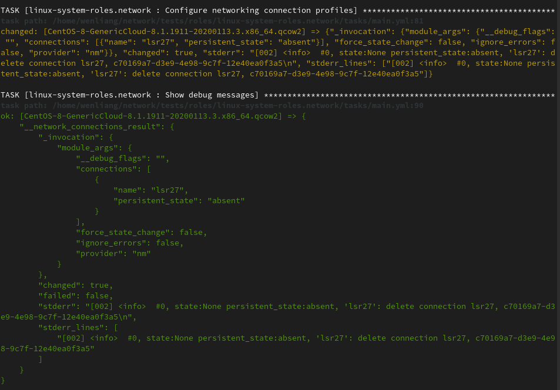
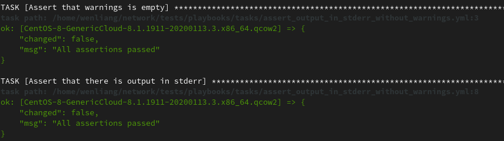

## Introduction

Before refactoring logging of network module, the module collects all logging statements,
and at the end returns them as “warnings”, so that they are shown by ansible. Obviously,
these are not really warnings, but rather debug information..

## How to reproduce

We can reproduce this network module bug by doing qemu test.

```bash
TEST_SUBJECTS=CentOS-8-GenericCloud-8.1.1911-20200113.3.x86_64.qcow2 ansible-playbook -vv -i /usr/share/ansible/inventory/standard-inventory-qcow2 ./tests/playbooks/tests_ethernet.yml
```


## How to resolve it

The logging messages should be returned in a different json field that is ignored by
ansible. Then, the tasks/main.yml should have a follow-up debug task that prints the
returned variable. In the failure case, the network_connections task must run ignoring
failures to reach the debug statement. Then, a follow up task should check whether the
network_connections task failed and abort.

## What is the result

After bug fixed, we can also use the same qemu test to compare the result:



## Additional test cases

Beyond that, we also have some assertion to confirm that we indeed separate Info and Debug logs.
In `./tests/tests_default.yml`, we have the following testing code to assert no warning
in _network_connections_result.

```yaml
---
- name: Test executing the role with default parameters
  hosts: all
  roles:
    - linux-system-roles.network
  tasks:
    - name: Test warning and info logs
      assert:
        that:
          - "'warnings' not in __network_connections_result"
        msg: "There are warnings"
```

In `./tests/tasks/assert_output_in_stderr_without_warnings.yml`, we assert no warning in
_network_connections_result, and assert stderr in _network_connections_result.

```yaml
---
- name: "Assert that warnings is empty"
  assert:
    that:
      - "'warnings' not in __network_connections_result"
    msg: "There are unexpected warnings"
- name: "Assert that there is output in stderr"
  assert:
    that:
      - "'stderr' in __network_connections_result"
    msg: "There are no messages in stderr"
```

The following Ansible logs is extracted from same qemu testing result after the bug fixed:




## Demo video

I made a demo video to show the bugs and refactoring logging of network module after bug fixed,
as well as additional test cases running result.

[](https://www.youtube.com/watch?v=gmFN2wt8tv4)

## Reference

1. Refactor logging of network module, https://github.com/linux-system-roles/network/issues/29
2. Separate debug and info logs from warnings, https://github.com/linux-system-roles/network/pull/207
